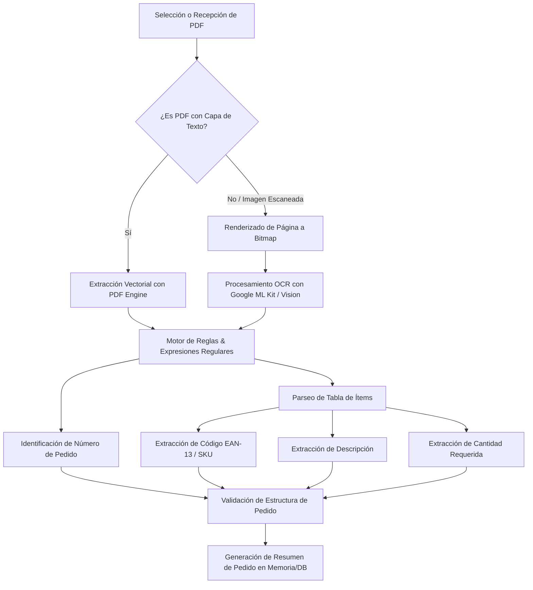
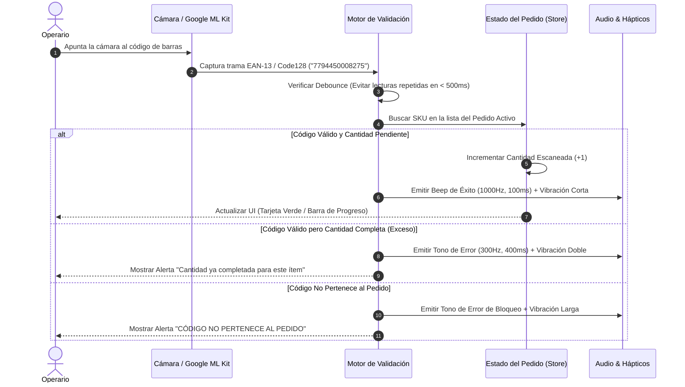
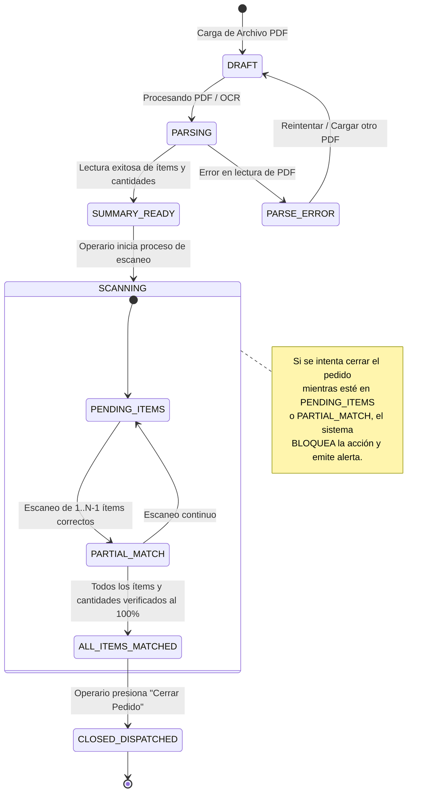

# Arquitectura del Sistema: Phone-Ware

**Phone-Ware** es una aplicación móvil ligera y de alto rendimiento diseñada para smartphones y tablets (Android e iOS). Su objetivo principal es optimizar y auditar el proceso de recepción, sumarizado y despacho de pedidos en depósitos de stock mediante la lectura de comprobantes en PDF y la verificación estricta por código de barras.

---

## 1. Visión General y Principios de Diseño

1. **Lightweight & High Performance**:
   - Inicio instantáneo (< 1.5s), bajo consumo de memoria RAM (< 80 MB) y huella de almacenamiento reducida.
   - Procesamiento e inferencia 100% en el dispositivo (On-Device Processing) sin depender de servidores externos para el escaneo o el parsing.
2. **Warehouse-First UX/UI**:
   - Diseñado específicamente para entornos de depósito: iluminación variable, uso de guantes, distancia de visión de 0.5m a 1m.
   - Alta visibilidad: contraste elevado (Dark Mode por defecto), indicadores LED simulados en pantalla, tipografía de gran tamaño.
   - Feedback multisensorial: tonos de audio diferenciados y respuesta háptica (vibraciones) para confirmación inmediata sin mirar la pantalla constantemente.
3. **Validación Estricta e Inviolable**:
   - La regla de negocio fundamental es la **imposibilidad de cerrar un pedido** si las cantidades escaneadas no coinciden exactamente (100%) con las cantidades requeridas en el comprobante PDF.
4. **Offline-First**:
   - Operatividad total sin conectividad Wi-Fi o celular. Los comprobantes y estados se persisten localmente.

---

## 2. Stack Tecnológico Seleccionado

Se proponen dos opciones tecnológicamente avanzadas según el canal de distribución deseado:

### Opción A (Recomendada): **React Native + Expo (SDK 51+) + Google ML Kit**

```
+-------------------------------------------------------------------+
|                       React Native UI Layer                       |
|           (NativeWind / Tailwind CSS + Reanimated 3)             |
+-------------------------------------------------------------------+
|               Business Logic & State Management                   |
|                  (Zustand + Drizzle ORM)                          |
+------------------------------------+------------------------------+
|   Native Camera & Barcode Module   |     PDF Engine & OCR         |
|  (expo-camera / ML Kit Barcode)    | (PDFKit / Vision ML Kit OCR) |
+------------------------------------+------------------------------+
|                    iOS & Android Device APIs                      |
|       (Audio, Haptics, SQLite, Filesystem, Camera Hardware)       |
+-------------------------------------------------------------------+
```

- **Framework**: React Native con Expo SDK 51+ (Architecture Fabric & TurboModules activados).
- **Escaneo de Código de Barras**: `expo-camera` con la API nativa de **Google ML Kit Barcode Scanning** (Android) y **Apple Vision / AVFoundation** (iOS).
- **Procesamiento de PDF & OCR**: `react-native-pdf` + `google-mlkit-text-recognition` (para comprobantes vectoriales y escaneados/imágenes).
- **Base de Datos Local**: `expo-sqlite` con `drizzle-orm` para persistencia ultrarrápida.
- **Audio & Hápticos**: `expo-av` (sonidos sintéticos a 0ms de latencia) y `expo-haptics`.

### Opción B: **PWA Híbrida (React + Vite + Capacitor + html5-qrcode / ZXing)**

- **Framework**: React 18+ con Vite (Single Page Application instalable como PWA).
- **Contenedor Móvil**: Capacitor 6+ para acceso nativo a cámara y sistema de archivos.
- **Escaneo**: `html5-qrcode` / `@zxing/library` utilizando la **Web Barcode Detector API** del navegador con fallback WASM.
- **Engine PDF**: `pdfjs-dist` para extracción de capa de texto + `tesseract.js` en Web Worker para OCR de comprobantes escaneados.
- **Persistencia**: IndexedDB vía `idb-keyval` o `Dexie.js`.

---

## 3. Pipeline de Procesamiento de PDF (Order Extraction Engine)

El sistema procesa comprobantes de pedidos en formato PDF (como los comprobantes de venta de plataformas como Contagram identificados en los ejemplos del depósito).

### Diagrama de Flujo del Procesamiento de PDF



### Reglas de Extracción para Comprobantes (Basado en Ejemplos de Depósito)

| Campo | Patrón de Búsqueda / Regex | Ejemplo Extraído |
| :--- | :--- | :--- |
| **N° de Pedido** | `DETALLE DE VENTA\s+(\d+)` o nombre de archivo | `3010`, `3158` |
| **Cliente / Razón Social** | `Razón Social:\s*(.+)` / `Nombre:\s*(.+)` | `DIEGO POKE`, `Diego Pascual` |
| **Fecha de Emisión** | `Fecha de Emisión:\s*(\d{2}/\d{2}/\d{4})` | `01/08/2026` |
| **Filas de Ítems** | Filas de tabla con columnas `[Código, Descripción, Cant., ...]` | EAN: `7794450008275`, Cant: `1` |

---

## 4. Arquitectura del Motor de Escaneo & Validación

### Diagrama del Proceso de Escaneo en Tiempo Real



---

## 5. Máquina de Estados del Pedido (Order State Machine)

El pedido pasa por un ciclo de vida strictly regulado. La transición al estado **CERRADO / DESPACHADO** está condicionada por la verificación al 100% de los ítems.



---

## 6. Esquema de Datos (Data Models)

### Objeto `Order` (Pedido)
```typescript
interface Order {
  id: string; // ID único interno (UUID)
  orderNumber: string; // Ej: "3010"
  clientName: string; // Ej: "DIEGO POKE"
  issueDate: string; // Ej: "01/08/2026"
  pdfFileName: string; // Ej: "34409313.pdf"
  status: 'DRAFT' | 'PARSED' | 'SCANNING' | 'VERIFIED' | 'CLOSED';
  createdAt: string; // Timestamp ISO-8601
  closedAt?: string; // Timestamp ISO-8601 de cierre
  totalItemsRequired: number; // Suma total de unidades requeridas
  totalItemsScanned: number; // Suma total de unidades escaneadas
  items: OrderItem[];
}
```

### Objeto `OrderItem` (Ítem del Pedido)
```typescript
interface OrderItem {
  id: string;
  orderId: string;
  code: string; // EAN-13 o SKU interno (Ej: "7794450008275" o "1130")
  description: string; // Ej: "Angelica Zapata Malbec"
  quantityRequired: number; // Cantidad requerida en el PDF (Ej: 6)
  quantityScanned: number; // Cantidad escaneada actualmente (Ej: 6)
  unitPrice?: number;
  status: 'PENDING' | 'IN_PROGRESS' | 'COMPLETED' | 'OVER_SCANNED';
}
```

### Objeto `ScanLog` (Auditoría de Escaneo)
```typescript
interface ScanLog {
  id: string;
  orderId: string;
  barcodeScanned: string;
  timestamp: string;
  result: 'SUCCESS' | 'UNMATCHED_CODE' | 'EXCESS_QUANTITY';
  matchedItemId?: string;
}
```

---

## 7. Estrategia de Despliegue y Distribución Móvil

1. **Android**:
   - Generación de APK standalone ultra-liviano (instalación directa vía side-loading en colectores de datos o tablets de depósito).
   - Publicación en Google Play Store / Managed Google Play para dispositivos corporativos (MDM).
2. **iOS**:
   - Distribución vía Apple TestFlight o Ad-Hoc / Enterprise App Store.
3. **Web / PWA**:
   - Despliegue en servidor HTTP estático (Nginx / Firebase Hosting) con Service Workers para caché de recursos offline.

---

## 8. Arquitectura de Gestión Multioferente & Auditoría en Carpetas

Para soportar múltiples operarios trabajando en paralelo en el mismo depósito, el sistema utiliza un flujo de tres carpetas físicas y la asignación de un **Identificador Híbrido** por dispositivo/persona (`{OPERARIO}-{DISPOSITIVO}`).

```
./delivery/
├── backlog/  --> Contiene comprobantes libres ({numero-pedido}.pdf)
├── doing/    --> Contiene comprobantes tomados ({numero-pedido}-{identificador}.pdf)
└── done/     --> Contiene comprobantes auditados finalizados con marca de agua ({numero-pedido}-{identificador}.pdf)
```

### Reglas de Transición de Archivos y Marca de Agua:

1. **Identificador Híbrido (`Option 3`)**:
   - Formato: `{OPERARIO}-{DISPOSITIVO}` (ej: `JAVIER-DEV82`).
   - Se compone del Nombre/Legajo del operario ingresado en la app + el ID hash del teléfono/tablet.

2. **Acción "Tomar Pedido" (Movimiento Físico en Disco)**:
   - Origen: `./delivery/backlog/{numero-pedido}.pdf`
   - Destino: `./delivery/doing/{numero-pedido}-{identificador}.pdf`
   - Operación: La app ejecuta `moveAsync` / `fs.renameSync` real en el disco para trasladar y renombrar el PDF físico.

3. **Acción "Liberar Pedido" (Devolución Física en Disco)**:
   - Origen: `./delivery/doing/{numero-pedido}-{identificador}.pdf`
   - Destino: `./delivery/backlog/{numero-pedido}.pdf`
   - Operación: La app remueve el identificador del nombre de archivo y lo mueve físicamente de regreso a `./delivery/backlog/{numero-pedido}.pdf`.

4. **Acción "Cerrar y Despachar Pedido" (Marca de Agua Física)**:
   - Origen: `./delivery/doing/{numero-pedido}-{identificador}.pdf`
   - Destino: `./delivery/done/{numero-pedido}-{identificador}.pdf`
   - **Incrustación Física de Marca de Agua / Sello de Auditoría**:
     - `AUDITADO POR`: `{OPERARIO}-{DISPOSITIVO}`
     - `FECHA Y HORA`: `YYYY-MM-DD HH:mm:ss`
     - `ESTADO`: `VERIFICADO 100% OK` (o `DESPACHO PARCIAL OK - PIN SUPERVISOR`).
     - Operación: El archivo se traslada a `./delivery/done/` e incrusta el registro del sello digital en el documento.

5. **Exclusividad del Espacio de Trabajo Limpio (Single Active Order Scope)**:
   - La interfaz de la aplicación NO mostrará listas de otros pedidos parseados ni mantendrá instancias de comprobantes cruzados en la vista principal.
   - La experiencia visual estará 100% dedicada y limpia para el pedido único asignado al operario en `./delivery/doing/`.
   - Si no hay pedido asignado, muestra únicamente la lista limpia de comprobantes libres en `./delivery/backlog/`.

6. **Persistencia y Auto-Recuperación al Iniciar la App (Doing Auto-Detection)**:
   - Durante la secuencia de inicio de la aplicación (`loadInitialOrders`), el sistema consulta automáticamente la existencia de comprobantes asignados al identificador del operario en `./delivery/doing/`.
   - Si detecta un archivo como `./delivery/doing/34409313-JAVIER-DEV82.pdf`, restaura automáticamente el Pedido `#34409313` como `activeOrder` activo.
   - Esto garantiza resistencia total a cierres forzados de la app o reinicios de dispositivo, impidiendo que el operario pueda tomar pedidos adicionales hasta liberar o finalizar el actual.

---

## 9. Aplicación Web de Administración & Tablero Kanban

El sistema cuenta con una plataforma Web autónoma (accesible vía navegador Web/Móvil por URL) construida bajo estándares modernos de React/TypeScript y un servidor Node/Express (`server.js`).

- **Tablero Kanban en Tiempo Real**:
  - **Columna Backlog**: Visualiza comprobantes libres en `./delivery/backlog/`.
  - **Columna Doing**: Visualiza pedidos tomados en `./delivery/doing/`, destacando el **Email/Nombre del Operario** y el **% de avance escaneado**.
  - **Columna Done**: Visualiza pedidos auditados y archivados en `./delivery/done/` con sus marcas de agua.

---

## 10. Sistema de Autenticación & Control de Acceso (Email + Password)

- **Gestión de Roles**:
  - `ADMIN`: Acceso total al Panel Kanban Web, carga de comprobantes PDF y administración de usuarios.
  - `OPERATOR`: Acceso a la App Móvil para tomar, escanear, liberar y despachar pedidos.

- **Configuración Inicial en `.env`**:
  - `ADMIN_EMAIL=admin@drinklovers.com`
  - `ADMIN_PASSWORD=drinklovers2026!`

- **Autenticación en App Móvil**:
  - Los operarios inician sesión con Email y Contraseña. El identificador del dispositivo (`operatorId`) se asocia automáticamente a la cuenta del operario (ej: `javier@drinklovers.com -> JAVIER-DEV82`).

---

## 11. Pipeline de Carga y Validación Automática de PDF

1. El Administrador carga un comprobante `.pdf` desde el Panel Web de Administración.
2. El servidor valida inmediatamente la estructura del documento:
   - Extracción de Número de Pedido, Cliente, Fecha e Ítems con códigos EAN.
3. Si el PDF es **Válido**:
   - Guarda los registros en la base de datos local SQLite.
   - Deposita el comprobante en `./delivery/backlog/{numero-pedido}.pdf`.
4. Si el PDF es **Inválido / Corrupto**:
   - Se rechaza la carga devolviendo un error explícito.

---

## 12. Base de Datos como Fuente Única de la Verdad & PDF Auto-Healing

- La base de datos SQLite (`phoneware.db`) almacena la totalidad del payload parseado del PDF, el binario del PDF (`pdfBlob`), y los registros de auditoría (`scan_logs`).
- **Resiliencia (PDF Auto-Healing)**: Si un archivo PDF físico en `./delivery/doing/` se corrompe o elimina accidentalmente, el sistema **re-genera el comprobante automáticamente desde los datos de la base de datos** y lo restituye en su carpeta correspondiente sin interrumpir la operación del depósito.

---

## 13. Modal Vista Formato Factura en Panel Web Admin

Al hacer clic en cualquier tarjeta del tablero Kanban (Backlog, Doing o Done), la aplicación Web Admin despliega un Modal / Drawer estilizado en formato **Factura / Comprobante de Venta**:
- **Encabezado Comercial**: Razón Social del Cliente, Número de Pedido, Fecha de Emisión y Vencimiento.
- **Detalle de Ítems**: Tabla completa con Código EAN, Descripción, Cantidad Requerida, Cantidad Verificada, Precio Unitario y Subtotal.
- **Estado de Auditoría & Asignación**: Muestra en vivo quién tiene el pedido asignado (`operatorEmail` / `operatorId`), en qué paso del proceso se encuentra (`BACKLOG`, `DOING` o `DONE`) y la fecha/marca de agua digital.

---

## 14. Almacenamiento en Blob PDF, Punto Único de Entrada y Eliminación/Recarga en Backlog

1. **Almacenamiento Blob de PDF**: Todos los archivos PDF subidos se almacenan en binario base64 / blob directamente en la base de datos.
2. **Punto Único de Entrada**: El Panel Web Admin es el único canal autorizado para ingresar nuevos comprobantes al flujo logístico.
3. **Eliminación y Recarga desde Backlog**:
   - En la columna Backlog del Panel Web Admin, los administradores pueden **eliminar** un comprobante PDF.
   - La eliminación borra el registro de la Base de Datos y elimina el archivo físico en `./delivery/backlog/`, permitiendo volver a subirlo y cargarlo desde cero.
