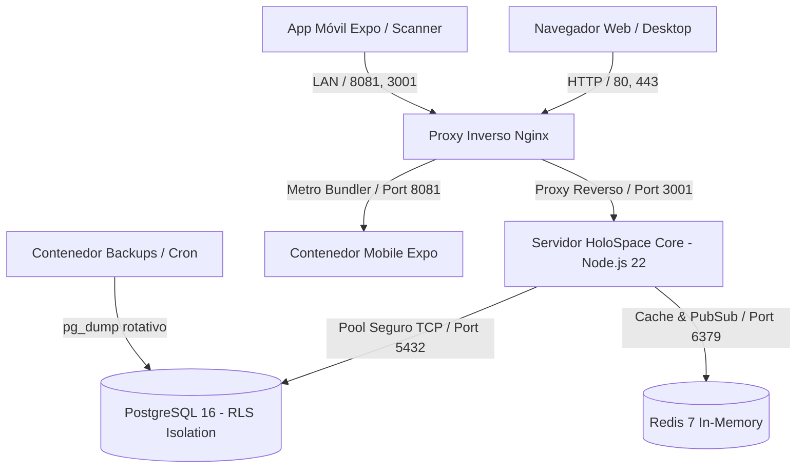
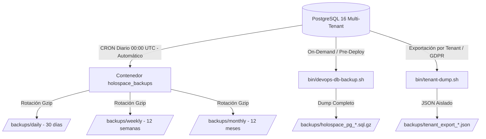

# Arquitectura Canónica e Infraestructura — HoloSpace Baseline

> Documento maestro de arquitectura del sistema, topología de infraestructura en Docker, aislamiento relacional multi-tenant con PostgreSQL 16 (RLS), motor de autenticación criptográfica, estrategia de respaldos y sistema de logging dinámico.

---

## 1. Visión General de la Arquitectura

HoloSpace Baseline es una plataforma SaaS B2B Multi-Tenant diseñada con arquitectura desacoplada, alta disponibilidad, separación estricta de responsabilidades y soberanía total de datos por organización cliente.



---

## 2. Estructura de Directorios del Código Fuente

```text
holospace-baseline/
├── .agents/                        ← Reglas y skills de agentes de inteligencia artificial
├── bin/                            ← Scripts de operaciones DevOps (refresco, backups, dump)
├── data/                           ← Esquema SQL canónico DDL y semillas oficiales
│   └── init-schema.sql
├── docs/                           ← 6 Documentos Canónicos de la Plataforma
│   ├── README.md                   ← Guía de inicio rápido, credenciales y comandos Docker
│   ├── ARCHITECTURE.md             ← Arquitectura técnica, BD PostgreSQL RLS y Motor de Temas
│   ├── MODULES.md                  ← Especificación de los 4 módulos oficiales y creación
│   ├── FEATURES.md                 ← Matriz de roles RBAC, planes comerciales y facturación
│   ├── CONTENT.md                  ← Copys oficiales de marketing, sprites y landing page
│   └── ROADMAP.md                  ← Evolución SaaS y matriz de trabajo
├── lib/                            ← Capas transversales del backend
│   ├── auth.js                     ← Hashing scrypt, JWT engine, middleware RBAC
│   ├── billing.js                  ← Catálogo de planes, auto-onboarding y webhooks
│   ├── db.js                       ← Adaptador relacional PostgreSQL con RLS
│   ├── entitlement.js              ← Motor de licenciamiento y feature flags
│   └── logger.js                   ← Motor de logging dinámico y estructurado
├── logs/                           ← Almacenamiento dinámico de logs (Global y Tenants)
│   ├── global/
│   └── tenants/
├── modules/                        ← 4 Módulos Oficiales Desacoplados
│   ├── core/                       ← Plataforma base, auth y motor de temas
│   ├── tenant/                     ← Gobierno SaaS (SuperAdmin)
│   ├── kanban/                     ← Tablero Kanban logístico web y parseo PDF
│   └── scanner/                    ← App Móvil Expo / React Native
├── nginx/                          ← Configuración del proxy inverso Nginx
├── public/                         ← Assets compilados del frontend web (SPA)
├── tests/                          ← Suite integral de pruebas automatizadas
├── Dockerfile                      ← Imagen de contenedor Node.js 22
├── docker-compose.yml              ← Orquestación multicontenedor de servicios
├── package.json                    ← Dependencias y scripts de ejecución
└── server.js                       ← Servidor HTTP y enrutador modular principal
```

---

## 3. Infraestructura y Orquestación Docker

```yaml
services:
  app:
    container_name: holospace_app
    ports: ["3001:3001"]
    depends_on:
      postgres: { condition: service_healthy }
  postgres:
    container_name: holospace_postgres
    image: postgres:16-alpine
    ports: ["5434:5432"]
    volumes: [postgres_data:/var/lib/postgresql/data]
  redis:
    container_name: holospace_redis
    image: redis:7-alpine
    ports: ["6382:6379"]
  proxy:
    container_name: holospace_proxy
    image: nginx:alpine
    ports: ["80:80", "443:443"]
  mobile:
    container_name: holospace_mobile
    ports: ["8081:8081", "19000-19001:19000-19001"]
  backups:
    container_name: holospace_backups
    image: prodrigestivill/postgres-backup-local:16-alpine
```

---

## 4. Aislamiento Multi-Tenant con PostgreSQL 16 (Row Level Security)

```sql
ALTER TABLE users ENABLE ROW LEVEL SECURITY;
ALTER TABLE orders ENABLE ROW LEVEL SECURITY;
ALTER TABLE order_items ENABLE ROW LEVEL SECURITY;
ALTER TABLE audit_logs ENABLE ROW LEVEL SECURITY;
ALTER TABLE tenant_modules ENABLE ROW LEVEL SECURITY;
ALTER TABLE app_settings ENABLE ROW LEVEL SECURITY;

CREATE POLICY rls_tenant_isolation ON orders
  FOR ALL
  USING (
    current_setting('app.is_superadmin', true) = 'true' 
    OR tenant_id = NULLIF(current_setting('app.current_tenant_id', true), '')::uuid
  )
  WITH CHECK (
    current_setting('app.is_superadmin', true) = 'true' 
    OR tenant_id = NULLIF(current_setting('app.current_tenant_id', true), '')::uuid
  );
```

---

## 5. Seguridad Criptográfica y Motor JWT (lib/auth.js)

- **Hashing de Contraseñas:** Algoritmo `scrypt` (`N=16384, r=8, p=1`) con salt criptográfico de 16 bytes.
- **JSON Web Tokens (JWT):** Firmados con HMAC-SHA256 con claims estructurados (`sub`, `tenantId`, `tenantSlug`, `role`, `entitlements`).

---

## 6. Estrategia de Respaldos y Recuperación ante Desastres (Disaster Recovery)

HoloSpace implementa un modelo de respaldos redundante de dos niveles para garantizar la continuidad del negocio y la integridad de datos de todas las empresas clientes:



### A. Nivel 1: Respaldos Automatizados en Docker (Daemon CRON)
- **Servicio:** Contenedor `holospace_backups` (`prodrigestivill/postgres-backup-local:16-alpine`).
- **Frecuencia (CRON):** `SCHEDULE=@daily` (se ejecuta automáticamente a las 00:00 UTC).
- **Compresión:** Algoritmo Gzip de nivel máximo (`-Z 9`).
- **Política de Retención y Rotación Automática:**
  - **Diarios:** Conserva los últimos 30 días (`BACKUP_KEEP_DAYS=30`).
  - **Semanales:** Conserva las últimas 12 semanas (`BACKUP_KEEP_WEEKS=12`).
  - **Mensuales:** Conserva los últimos 12 meses (`BACKUP_KEEP_MONTHS=12`).

### B. Nivel 2: Respaldos On-Demand y Exportación por Tenant
1. **Respaldo Global Inmediato (Pre-Deploy / Mantenimiento):**
   ```bash
   ./bin/devops-db-backup.sh
   ```
   Genera instantáneamente un archivo comprimido verificado: `/backups/holospace_pg_YYYYMMDD_HHMMSS.sql.gz`.

2. **Exportación Aislada de una Sola Empresa (Data Portability / GDPR):**
   ```bash
   ./bin/tenant-dump.sh drinklovers
   ```
   Extrae únicamente los pedidos, usuarios, configuraciones y módulos del tenant especificado en formato JSON.

### C. Procedimiento de Restauración ante Desastres (Disaster Recovery):
Para restaurar una copia de seguridad en caso de fallo catastrófico:
```bash
# 1. Descomprimir el respaldo deseado
gunzip -c backups/holospace_pg_YYYYMMDD_HHMMSS.sql.gz | docker exec -i holospace_postgres psql -U holospace_admin -d holospace_saas
```

## 7. Estrategia de Logging y Telemetría (lib/logger.js)

- **Global:** `logs/global/app-YYYY-MM-DD.log` y `logs/global/error-YYYY-MM-DD.log`.
- **Tenants:** `logs/tenants/<slug>/activity.log`, `audit.log` y `errors.log` creados dinámicamente.

---

## 7. Sistema de Temas y Diseño Centralizado (HoloSpace HW-DS Engine)

> **Ubicación Canónica de Definiciones:** `/modules/themes/`  
> **Archivo Único de la Verdad (Single Source of Truth):** `/modules/themes/themes.json`  
> **API de Suministro:** `GET /api/theme` / `POST /api/theme`  
> **Consumidores:** Servidor Backend (`server.js`), Web App (`public/app.js`), Mobile App (`modules/scanner/src/store/useThemeStore.ts`).

### 7.1 Metodología de Temas: Single Source of Truth
1. **Cero Hardcoding en Módulos:** Queda terminantemente prohibido definir archivos de temas o colores duplicados dentro de las carpetas individuales de cada módulo (`modules/core`, `modules/kanban`, `modules/scanner`, etc.).
2. **Definición Declarativa Central:** Todos los temas y sus tokens residen en un único archivo JSON: `modules/themes/themes.json`.
3. **Módulo Exportador Node.js:** `modules/themes/index.js` exporta el diccionario `THEMES` y las funciones de consulta (`getTheme`, `listThemes`) para el backend.
4. **Distribución en Tiempo Real (API REST):**
   - El endpoint `GET /api/theme` entrega en tiempo real los tokens del tema según la jerarquía:
     - **Preferencia de Usuario:** Guardada en la columna `users.theme_preference`.
     - **Preferencia de Tenant:** Guardada en la tabla `app_settings (active_theme)`.
     - **Fallback de Plataforma:** `omarchy_tiling`.

### 7.2 Catálogo Oficial de los 5 Temas de Plataforma

| Clave (`key`) | Nombre Oficial | Tipografía | Radio Borde | Fondo Principal | Acento Principal |
| :--- | :--- | :--- | :--- | :--- | :--- |
| **`omarchy_tiling`** | **Omarchy Tiling** *(Predeterminado)* | `JetBrains Mono` / `Press Start 2P` | `4px` (Tiling estricto) | `#121317` | Verde Menta (`#A6DA95`) |
| **`omarchy_aetheria`** | **Omarchy Aetherial** | `JetBrains Mono` / `Press Start 2P` | `4px` (Tiling estricto) | `#0E091D` (OLED) | Teal (`#14B9B5`) / Violeta (`#7C3AED`) |
| **`soft_minimal_pastel`** | **Soft Pastel** | `Plus Jakarta Sans` | `16px` / `20px` (Píldoras) | `#1E1E2E` (Catppuccin) | Menta (`#A6E3A1`) / Lavanda (`#89B4FA`) |
| **`dark_glassmorphism`** | **Dark Glass** | `Outfit` | `24px` (Glass) | `#0B0E14` (Cristal oscuro) | Esmeralda (`#00E676`) / Cobalto (`#3B82F6`) |
| **`cyberpunk_glassmorphism`**| **Cyberpunk Glass** | `Press Start 2P` | `8px` (Synthwave) | `#05050A` (Neon) | Cian (`#00FFCC`) / Magenta (`#FF007F`) |

### 7.3 Mapa de Tokens Estándar por Tema (`modules/themes/themes.json`)
```json
{
  "key": "omarchy_tiling",
  "name": "Omarchy Tiling",
  "background": "#121317",
  "cardBg": "#1A1B22",
  "cardBorder": "#2E303E",
  "emerald": "#A6DA95",
  "cobalt": "#BD93F9",
  "amber": "#F1FA8C",
  "red": "#FF5555",
  "textMain": "#F8F8F2",
  "textMuted": "#6272A4",
  "fontFamily": "JetBrains Mono",
  "fontMono": "JetBrains Mono",
  "borderRadius": 4,
  "radiusCard": 4,
  "radiusBtn": 4,
  "radiusBadge": 2,
  "borderWidth": 1,
  "backdropBlur": "none",
  "boxShadow": "none"
}
```

### 7.4 Regla de Aislamiento de Fondos Dinámicos
* Fondo Dinámico Espacial (Estrellas a 60s, grilla y asteroides): Confinado exclusivamente a Landing Page (/landing) y Pantalla de Login (/login).
* Módulos Internos Autenticados (/tenant, /core, /kanban, /scanner): Fondo estático sólido limpio sin animaciones para garantizar máximo rendimiento, legibilidad y ahorro de batería.

---

## 8. Protocolo de Sincronización y Consistencia de Pedidos (ScanBan Web <-> Scanner Mobile)

Para garantizar consistencia atómica e impedir falsos positivos de desasignación entre el Tablero Kanban y el Escáner Móvil:
1. **Columnas de Asignación Duales en PostgreSQL:** Toda mutación hacia estado `DOING` actualiza de manera idempotente tanto `operator_email` como `assigned_operator_email`.
2. **Consultas Unificadas de Pedidos en Proceso:** Los endpoints `/api/scanban/my-doing-orders` y `/api/scanban/active-order` filtran con `(LOWER(operator_email) = ? OR LOWER(assigned_operator_email) = ?)` asegurando que cualquier orden asignada por administrador o tomada por operario sea descubierta de inmediato.
3. **Validación Estricta de Toma de Pedidos en Cliente:** El servicio `fileWorkflowService.claimOrder` y el store `useOrderStore` validan la confirmación del servidor HTTP 200 con payload de orden persistida antes de transicionar la interfaz local, evitando pedidos en memoria no respaldados por la base de datos.
4. **Aislamiento Multi-Tenant Exhaustivo en Helpers de Base de Datos:** La función central `getFullOrderFromDb` y todos los endpoints de mutación y lectura (`mark-ready`, `mark-backlog`, `assign-order`, `release-order-admin`, `delete-order`, `claim-order`, `complete-order`, `pdf-raw`) incluyen obligatoriamente la cláusula `AND tenant_id = ?`, erradicando colisiones de números de pedido idénticos entre organizaciones diferentes.
