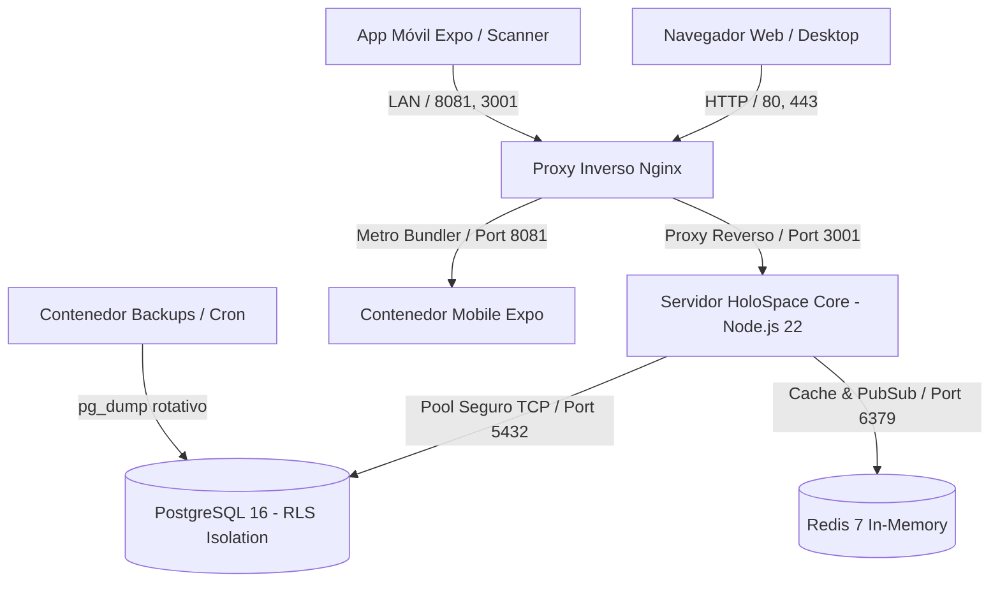

# Arquitectura Canónica e Infraestructura — HoloSpace Baseline

> Documento maestro de arquitectura del sistema, topología de infraestructura en Docker, aislamiento relacional multi-tenant con PostgreSQL 16 (RLS), motor de autenticación criptográfica, estrategia de respaldos y sistema de logging dinámico.

---

## 1. Visión General de la Arquitectura

HoloSpace Baseline es una plataforma SaaS B2B Multi-Tenant diseñada con arquitectura desacoplada, alta disponibilidad, separación estricta de responsabilidades y soberanía total de datos por organización cliente.



---

## 2. Estructura de Directorios del Código Fuente

```text
holospace-baseline/
├── .agents/                        ← Reglas y skills de agentes de inteligencia artificial
├── bin/                            ← Scripts de operaciones DevOps (refresco, backups, dump)
├── data/                           ← Esquema SQL canónico DDL y semillas oficiales
│   └── init-schema.sql
├── docs/                           ← 4 Documentos Canónicos de la Plataforma
│   ├── ARCHITECTURE.md             ← (Este documento)
│   ├── FEATURES.md                 ← Capacidades, UI/UX, Temas y Facturación
│   ├── MODULES.md                  ← Especificación de los 4 módulos oficiales y creación
│   └── ROADMAP.md                  ← Evolución SaaS y matriz de trabajo
├── lib/                            ← Capas transversales del backend
│   ├── auth.js                     ← Hashing scrypt, JWT engine, middleware RBAC
│   ├── billing.js                  ← Catálogo de planes, auto-onboarding y webhooks
│   ├── db.js                       ← Adaptador relacional PostgreSQL con RLS
│   ├── entitlement.js              ← Motor de licenciamiento y feature flags
│   └── logger.js                   ← Motor de logging dinámico y estructurado
├── logs/                           ← Almacenamiento dinámico de logs (Global y Tenants)
│   ├── global/
│   └── tenants/
├── modules/                        ← 4 Módulos Oficiales Desacoplados
│   ├── core/                       ← Plataforma base, auth y motor de temas
│   ├── tenant/                     ← Gobierno SaaS (SuperAdmin)
│   ├── kanban/                     ← Tablero Kanban logístico web y parseo PDF
│   └── scanner/                    ← App Móvil Expo / React Native
├── nginx/                          ← Configuración del proxy inverso Nginx
├── public/                         ← Assets compilados del frontend web (SPA)
├── tests/                          ← Suite integral de pruebas automatizadas
├── Dockerfile                      ← Imagen de contenedor Node.js 22
├── docker-compose.yml              ← Orquestación multicontenedor de servicios
├── package.json                    ← Dependencias y scripts de ejecución
└── server.js                       ← Servidor HTTP y enrutador modular principal
```

---

## 3. Infraestructura y Orquestación Docker

```yaml
services:
  app:
    container_name: holospace_app
    ports: ["3001:3001"]
    depends_on:
      postgres: { condition: service_healthy }
  postgres:
    container_name: holospace_postgres
    image: postgres:16-alpine
    ports: ["5434:5432"]
    volumes: [postgres_data:/var/lib/postgresql/data]
  redis:
    container_name: holospace_redis
    image: redis:7-alpine
    ports: ["6382:6379"]
  proxy:
    container_name: holospace_proxy
    image: nginx:alpine
    ports: ["80:80", "443:443"]
  mobile:
    container_name: holospace_mobile
    ports: ["8081:8081", "19000-19001:19000-19001"]
  backups:
    container_name: holospace_backups
    image: prodrigestivill/postgres-backup-local:16-alpine
```

---

## 4. Aislamiento Multi-Tenant con PostgreSQL 16 (Row Level Security)

```sql
ALTER TABLE users ENABLE ROW LEVEL SECURITY;
ALTER TABLE orders ENABLE ROW LEVEL SECURITY;
ALTER TABLE order_items ENABLE ROW LEVEL SECURITY;
ALTER TABLE audit_logs ENABLE ROW LEVEL SECURITY;
ALTER TABLE tenant_modules ENABLE ROW LEVEL SECURITY;
ALTER TABLE app_settings ENABLE ROW LEVEL SECURITY;

CREATE POLICY rls_tenant_isolation ON orders
  FOR ALL
  USING (
    current_setting('app.is_superadmin', true) = 'true' 
    OR tenant_id = NULLIF(current_setting('app.current_tenant_id', true), '')::uuid
  )
  WITH CHECK (
    current_setting('app.is_superadmin', true) = 'true' 
    OR tenant_id = NULLIF(current_setting('app.current_tenant_id', true), '')::uuid
  );
```

---

## 5. Seguridad Criptográfica y Motor JWT (lib/auth.js)

- **Hashing de Contraseñas:** Algoritmo `scrypt` (`N=16384, r=8, p=1`) con salt criptográfico de 16 bytes.
- **JSON Web Tokens (JWT):** Firmados con HMAC-SHA256 con claims estructurados (`sub`, `tenantId`, `tenantSlug`, `role`, `entitlements`).

---

## 6. Estrategia de Respaldos y Dump DevOps

1. **Backups Globales Diarios:** `bin/devops-db-backup.sh` (Dumps automáticos a las 02:00 UTC en `/backups`).
2. **Exportación Aislada por Tenant:** `bin/tenant-dump.sh <tenant_slug>`.

---

## 7. Estrategia de Logging y Telemetría (lib/logger.js)

- **Global:** `logs/global/app-YYYY-MM-DD.log` y `logs/global/error-YYYY-MM-DD.log`.
- **Tenants:** `logs/tenants/<slug>/activity.log`, `audit.log` y `errors.log` creados dinámicamente.
