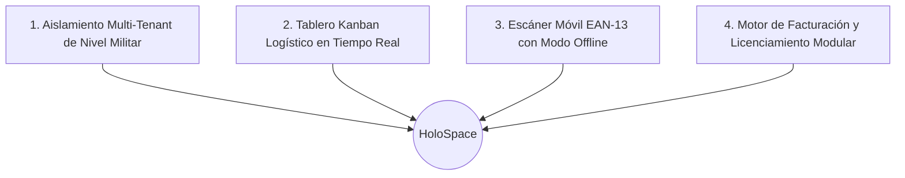

# 🚀 HoloSpace Baseline — Estrategia de Contenidos & Landing Page World-Class

> Documento maestro de marketing, propuesta de valor, arquitectura de persuasión, pilares de ingeniería y copy para la Landing Page oficial de HoloSpace Baseline.

---

## 🎯 1. Propuesta de Valor Central (Hero Section)

### Titular de Alto Impacto (H1):
**"El Sistema Operativo SaaS Multi-Tenant para Logística Inteligente y Control Total de Depósitos."**

### Subtítulo (Subheadline):
*Digitaliza el flujo de preparación de pedidos, elimina errores de despacho con escaneo EAN-13 móvil en tiempo real y gestiona múltiples empresas con aislamiento estricto de datos en una infraestructura soberana de alto rendimiento.*

### Llamados a la Acción Principales (CTAs):
- **Botón Primario:** `[ Iniciar Prueba Gratuita ]` $\rightarrow$ Lleva al Auto-Onboarding B2B (`POST /api/billing/register`).
- **Botón Secundario:** `[ Ver Demo en Vivo ]` $\rightarrow$ Acceso guiado interactivo al Tablero Kanban.

### Badge de Autoridad / Confianza:
`⚡ PostgreSQL 16 RLS Criptográfico • Docker Multi-Tenant • 100% Offline-Ready`

---

## 🏛️ 2. Los 4 Pilares Fundamentales del Sistema

### Pilar 1: Aislamiento Criptográfico y Soberanía de Datos (Security-First)
- **Problema que resuelve:** El riesgo de fuga de información entre empresas en la nube.
- **La Solución HoloSpace:** Implementación de **PostgreSQL 16 Row Level Security (RLS)** a nivel de motor de base de datos. Ningún tenant puede leer ni escribir datos de otra organización bajo ninguna circunstancia.
- **Beneficio para el cliente:** Cumplimiento total con normativas internacionales de privacidad (GDPR, SOC2) y tranquilidad para empresas medianas y grandes.

### Pilar 2: Flujo Operativo Kanban con Parseo Inteligente de Comprobantes
- **Problema que resuelve:** La pérdida de tiempo y el caos de coordinar pedidos impresos en papel en depósitos.
- **La Solución HoloSpace:**
  1. Arrastra una factura PDF y el sistema extrae automáticamente clientes, números de pedido, SKUs, códigos de barra y cantidades sin inventar datos.
  2. Tablero interactivo de 4 columnas: **Backlog**, **Listo para Preparar**, **En Proceso** y **Completado**.
  3. Asignación directa de pedidos a operarios específicos con balanceo de carga.

### Pilar 3: Escáner Móvil EAN-13 Nativo con Sincronización Offline (PWA / Expo)
- **Problema que resuelve:** Zonas del depósito con mala señal de Wi-Fi y errores de despacho humano.
- **La Solución HoloSpace:**
  1. Lectura instantánea de códigos de barra utilizando la cámara de cualquier celular (iOS / Android).
  2. Base de datos SQLite local en el dispositivo móvil con capacidad de escanear y auditar stock sin conexión a internet.
  3. Feedback sensorial inmediato: Sonidos de éxito/error y vibración háptica.

### Pilar 4: Facturación B2B, Auto-Onboarding y Licenciamiento Dinámico
- **Problema que resuelve:** Procesos manuales lentos para dar de alta nuevos clientes y cobrar suscripciones.
- **La Solución HoloSpace:**
  1. Auto-registro con aprovisionamiento instantáneo de base de datos y emisión de token JWT.
  2. Checkout integrado y gestión de cuotas de usuarios y órdenes mensuales.
  3. Licenciamiento modular en caliente: Habilita o desactiva módulos (`kanban`, `scanner`, etc.) por empresa sin reiniciar el servidor.

---

## 💎 3. Catálogo Oficial de Planes Comerciales (Pricing Table)

| Característica | Plan STARTER | Plan PRO (Recomendado) | Plan ENTERPRISE |
| :--- | :---: | :---: | :---: |
| **Precio Mensual** | **$49 USD / mes** | **$149 USD / mes** | **$499 USD / mes** |
| **Usuarios Incluidos** | Hasta **5 usuarios** | Hasta **15 usuarios** | **999 (Ilimitados)** |
| **Volumen de Pedidos** | Hasta **500 órdenes / mes** | Hasta **3.000 órdenes / mes** | **999.999 órdenes / mes** |
| **Módulo Core & Auth** | ✅ Incluido | ✅ Incluido | ✅ Incluido |
| **Tablero Kanban Web** | ✅ Incluido | ✅ Incluido | ✅ Incluido |
| **Scanner Móvil EAN-13** | ✅ Incluido | ✅ Incluido | ✅ Incluido |
| **Panel Gobierno Tenant** | ❌ | ❌ | ✅ **Exclusivo SuperAdmin** |
| **Motor de Temas UI** | Omarchy Tiling | 5 Temas Completos | Personalización Total |
| **Soporte Técnico** | Email estándar | Prioritario | Dedicado 24/7 + SLA |
| **CTA del Plan** | `[ Comenzar Starter ]` | `[ Probar Plan Pro ]` | `[ Contactar Ventas ]` |

---

## 🎨 4. Experiencia Visual y Personalización (UI/UX Showcase)

- **Motor de Temas Jerárquico:**
  - *Omarchy Tiling WM (Dracula)*: Estética terminal y tiling para máxima productividad.
  - *Omarchy Aetheria*: Suavidad visual con acentos Teal y Violeta.
  - *Dark Glassmorphism*: Elegancia translúcida con `backdrop-filter: blur(12px)`.
  - *Cyberpunk*: Alto contraste Neón para depósitos oscuros o trabajo nocturno.
  - *Soft Minimal Pastel*: Descanso visual para oficinas de administración.
- **Cero Modales Nativos:** Cero popups molestos de `alert()` o `confirm()`. Toda la interfaz respira diseño nativo personalizado.

---

## 🛡️ 5. Respaldo Técnico y Recuperación ante Desastres

- **Backups Automáticos Diarios:** Daemon CRON en Docker con compresión Gzip máxima y retención de 30 días, 12 semanas y 12 meses.
- **Data Portability (GDPR):** Exportación de datos aislada por tenant en formato JSON con un solo clic o comando (`bin/tenant-dump.sh`).
- **Infraestructura Contenerizada:** 100% dockerizada (Node.js 22, PostgreSQL 16, Redis 7, Nginx) lista para correr en servidores propios (Hetzner, AWS, Bare Metal).

---

## ❓ 6. Preguntas Frecuentes (FAQ Section)

#### ¿Mis operarios necesitan descargar una app pesada desde la App Store?
*No obligatoriamente. Pueden escanear el código QR en pantalla y abrir el escáner directamente en Safari o Chrome (`https://m.holospace.com.ar`) con acceso instantáneo a la cámara web, o utilizar Expo Go si prefieren una experiencia nativa.*

#### ¿Qué sucede si mi depósito pierde la conexión a Internet durante el picking?
*HoloSpace Scanner almacena los pedidos en la base de datos local SQLite del celular. Los operarios pueden seguir validando códigos de barra y los datos se sincronizan automáticamente con el servidor en cuanto vuelve la conexión.*

#### ¿Puedo integrar HoloSpace con mi sistema de facturación o ERP actual?
*Sí. HoloSpace cuenta con una API REST modular con autenticación JWT que permite importar pedidos mediante JSON o parsear directamente comprobantes de facturación en formato PDF.*
