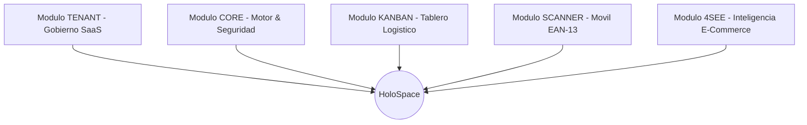

# HoloSpace Baseline — Estrategia de Contenidos & Landing Page World-Class

> Documento maestro de marketing, propuesta de valor, arquitectura de persuasión, pilares de ingeniería, especificación de los 5 módulos con estética sprite pixel art y catálogo de precios en Pesos Argentinos (ARS).

---

## 1. Propuesta de Valor Central (Hero Section)

### Titular de Alto Impacto (H1):
**"El Sistema Operativo SaaS Multi-Tenant para Logística Inteligente y Control Total de Depósitos."**

### Subtítulo (Subheadline):
*Digitaliza el flujo de preparación de pedidos, elimina errores de despacho con escaneo EAN-13 móvil en tiempo real y gestiona múltiples empresas con aislamiento estricto de datos en una infraestructura soberana de alto rendimiento.*

### Llamados a la Acción Principales (CTAs):
- **Botón Primario:** `[ Iniciar Prueba Gratuita ]` -> Desplazamiento suave a la tabla de planes comerciales (`#planes`).
- **Botón Secundario:** `[ Ver Demo en Vivo ]` -> Acceso guiado interactivo a la aplicación web (`/login`).

### Badge de Autoridad / Confianza:
`PostgreSQL 16 RLS Criptografico • Docker Multi-Tenant • 100% Offline-Ready`

---

## 2. Los 5 Módulos de la Plataforma (Sprites Pixel Art)

### Módulo 1: TENANT (Gobierno SaaS & Multitenancy)
- **Estética Sprite:** Castillo / Edificio central con corona dorada (`#EED49F`).
- **Propósito:** Panel exclusivo para SuperAdmin.
- **Capacidades:** Directorio de organizaciones cliente, alta y edición de empresas, suspensión inmediata, asignación de cuotas de usuarios y órdenes, y toggle de licencias modulares en caliente.

### Módulo 2: CORE (Plataforma Base & Seguridad Criptográfica)
- **Estética Sprite:** Núcleo de energía / Chip CPU con pulso neón (`#8AADF4`).
- **Propósito:** Capa fundamental del sistema.
- **Capacidades:** Aislamiento relacional PostgreSQL 16 con Row Level Security (RLS), autenticación segura con hashing `scrypt` y JWT, auditoría de eventos de plataforma y motor de temas visuales jerárquicos (Omarchy Tiling, Aetheria, Glassmorphism).

### Módulo 3: KANBAN (Logística Web & Ingesta PDF)
- **Estética Sprite:** Tablero de misiones / Pergamino logístico (`#A6DA95`).
- **Propósito:** Gestión operativa de pedidos para depósitos y centros de distribución.
- **Capacidades:** Tablero interactivo de 4 columnas (Backlog, Listo, En Proceso, Completado), parser inteligente de facturas PDF (extracción sin inventar datos de clientes, SKUs, códigos de barra y cantidades) y asignación balanceada a operarios.

### Módulo 4: SCANNER (App Móvil EAN-13 con Modo Offline)
- **Estética Sprite:** Gameboy / Lector láser retro (`#F5A97F` / `#ED8796`).
- **Propósito:** Aplicación nativa y web para operarios de picking y depósito.
- **Capacidades:** Lectura ultrarrápida de códigos de barra EAN-13 utilizando la cámara del celular, base de datos local SQLite (`holospace.db`) para operar en zonas de depósito sin Wi-Fi, feedback sensorial (sonidos de éxito/error y vibración háptica) y conexión instantánea vía QR.

### Módulo 5: 4SEE (Inteligencia E-Commerce & Repricing en Piloto Automático)
- **Estética Sprite:** Radar orbital / Ojo cibernético retro (`#C6A0F6` / `#F5A97F`).
- **Propósito:** Vigilancia automática de competidores, auditoría de catálogo y repricing táctico de márgenes.
- **Capacidades:** Scraping continuo y monitorización de precios de competidores (Mercado Libre, Tienda Nube, Shopify), Diff View interactivo para auditar discrepancias de precio propio vs mercado con aprobación en 1 clic, motor de rentabilidad real con deducción de comisiones de canal, impuestos y flete, alertas visuales de zona roja y sugerencias de repricing táctico (+8%).

---

## 3. Catálogo Oficial de Planes Comerciales (Referencia Interna de Facturación B2B)

> Nota de Despliegue: La sección visual de precios fue retirada temporalmente de la Landing Page pública para priorizar la exploración interactiva de los 5 módulos funcionales. El catálogo y cuotas se mantienen activos a nivel backend y módulo Tenant.

| Característica | Plan STARTER | Plan PRO (Recomendado) | Plan ENTERPRISE |
| :--- | :---: | :---: | :---: |
| **Precio Mensual (ARS)** | **$ 65.000 ARS / mes** | **$ 195.000 ARS / mes** | **$ 590.000 ARS / mes** |
| **Usuarios Activos** | Hasta **5 usuarios** | Hasta **15 usuarios** | **999+ (Ilimitados)** |
| **Volumen de Pedidos** | Hasta **500 órdenes / mes** | Hasta **3.000 órdenes / mes** | **999.999 órdenes / mes** |
| **Módulo Core & Auth** | Incluido | Incluido | Incluido |
| **Tablero Kanban Logístico** | Incluido | Incluido | Incluido |
| **Escáner Móvil EAN-13** | Incluido | Incluido | Incluido |
| **Módulo 4see Intelligence** | No incluido | Incluido | Incluido |
| **Panel Gobierno Tenant** | No disponible | No disponible | **Exclusivo SuperAdmin** |
| **Motor de Temas UI** | Omarchy Tiling | 5 Temas Completos | Personalización Total |
| **Soporte Técnico** | Email estándar | Prioritario | Dedicado 24/7 + SLA |

---

## 4. Seguridad, Soberanía y Respaldo Técnico

- **Aislamiento Criptográfico RLS:** Cumplimiento con normativas internacionales de privacidad (GDPR, SOC2).
- **Backups Automáticos Diarios:** Daemon CRON en Docker con compresión Gzip máxima y retención de 30 días, 12 semanas y 12 meses.
- **Data Portability (GDPR):** Exportación de datos aislada por tenant en formato JSON con un solo comando (`bin/tenant-dump.sh`).
- **Infraestructura Contenerizada:** 100% dockerizada (Node.js 22, PostgreSQL 16, Redis 7, Nginx) lista para servidores propios (Hetzner, AWS, Bare Metal).

